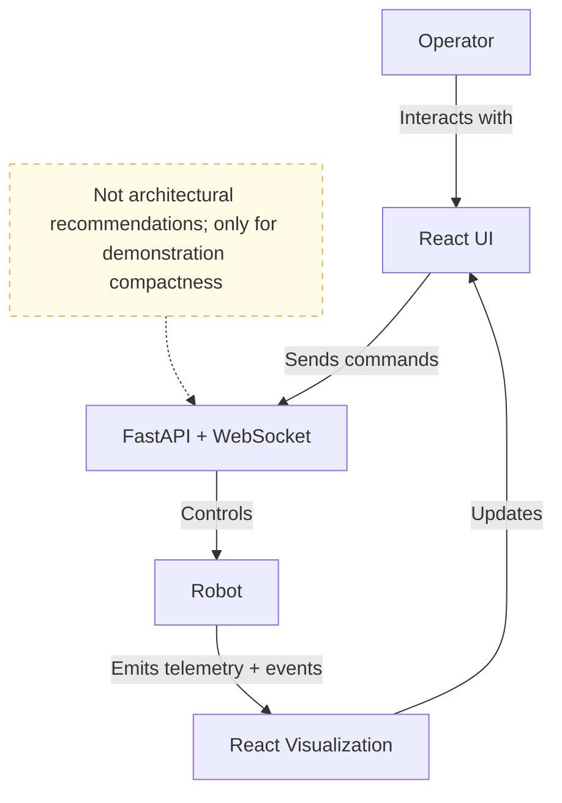

# Robot State and Command Visibility

A React and FastAPI failure-mode study of operator trust: what a robot dashboard should show when it cannot honestly claim to know the robot's state.

## Why

A robot dashboard has one failure it cannot afford: confidently visualizing a state that is not true. Rough edges are recoverable; a wrong robot state destroys the operator's trust in the tool, and an untrusted control surface is worse than none.

Operator UIs invite that failure by collapsing four different things into one "robot state": what the operator intended, what the command pipeline reports, what the robot was last observed doing, and how old that observation is. This demo keeps them separate — visually and in the protocol — so that when they disagree, the UI reports uncertainty instead of a confident guess.

## Failure scenarios

Three failure modes can be injected on demand from the UI, each reproducing a race between operator intent and observed state:

- **Observation delay** — telemetry goes stale while the WebSocket stays open. The UI degrades a liveness indicator, locks normal motion controls, and keeps emergency stop available.
- **Execution failure** — a rotation command is acknowledged and starts executing, then fails before the robot's heading changes. The UI distinguishes "accepted" from "done."
- **Lost completion** — a movement executes successfully, but the connection drops before the completion event is delivered. The UI reports the outcome as *unknown*, disables retry, and reconciles from the authoritative backend ledger after reconnect.

## Invariants

The scenarios exist to pin two invariants with regression tests:

> A command with an external side effect must never be retried merely because its response was lost.

> A message from an expired control epoch must never mutate the current operator state.

Commands carry client-generated IDs against a backend command ledger (resending a known ID returns its recorded outcome, never re-executes), and every message is fenced by a session epoch.

## Coverage


| Surface       | Freshness                                                    | Ordering                                  | Identity                                | Authority                                  | Recovery                                     |
| ------------- | ------------------------------------------------------------ | ----------------------------------------- | --------------------------------------- | ------------------------------------------ | -------------------------------------------- |
| Visualization | ✅ Is it current?                                             | 🟡 Can old state overwrite new?            | —                                       | ✅ Which source should the operator trust?  | ✅ How is uncertainty shown after reconnect?  |
| Control       | 🟡 Can a delayed command execute after its context expired?   | ✅ Can commands execute out of sequence?   | ✅ Can retries duplicate action?         | ❌ Who currently owns control?              | ✅ How is ambiguous execution reconciled?     |
| Observability | —                                                             | 🟡 Can event order be reconstructed?       | ✅ Can events be correlated end to end?  | ✅ Which record is authoritative?           | —                                            |

✅ addressed in the current implementation&emsp;🟡 partially addressed&emsp;❌ not addressed&emsp;— consolidated into other cells

<details>
<summary>Consolidated cells (—)</summary>

- **visualization identity** decomposes into visualization ordering (epoch fencing) plus observability identity (commandId correlation);
- **observability freshness** is answered by the same telemetry-age check as visualization freshness — separate sequence-gap detection would only matter on a lossy transport;
- **observability recovery** is the conjunction of observability authority and control recovery, all three answered by the same ledger-backed reconciliation event.

</details>

<details>
<summary>Why each 🟡 / ❌</summary>

- **Visualization / Ordering 🟡** — Messages from an expired session epoch are fenced out client-side, but the `sequence` number the backend attaches to every `robot_state` is never checked by the client, so in-session ordering rests on the WebSocket transport alone.
- **Control / Freshness 🟡** — The UI locks motion controls while telemetry is stale or the connection is down, but the backend does not validate the epoch a command was issued under and commands have no expiry, so a command delayed in transit would still execute.
- **Control / Authority ❌** — There is no control-ownership model. A newer session takes over message delivery, but a superseded connection that is still open can submit commands that execute; the backend never compares an incoming command's session epoch to the current one.
- **Observability / Ordering 🟡** — The client event log preserves insertion order but carries no timestamps, keeps only the last 30 entries, and there is no server-side event history to reconstruct from.

</details>

## How



## Run

```sh
docker compose up --build
```

Then open http://localhost:3000 and pick a failure scenario from the control panel.

For local development with hot reloading:

```sh
pnpm dev
```

## Tests

Backend tests cover command idempotency, telemetry staleness and recovery, emergency-stop interruption, and post-disconnect reconciliation; frontend tests cover the operator-facing state machine, expired-epoch rejection, telemetry freshness classification, and the event log. CI runs tests, lint, and build for both sides.

```sh
pnpm test
```

## Demo limitations

The WebSocket session epoch, simulated robot state, and command ledger are kept in backend process memory. Restarting the backend resets command history, robot pose, active faults, queued stale events, and reconciliation state. This is intentional for the deterministic demo and is not a production durability or safety design.
