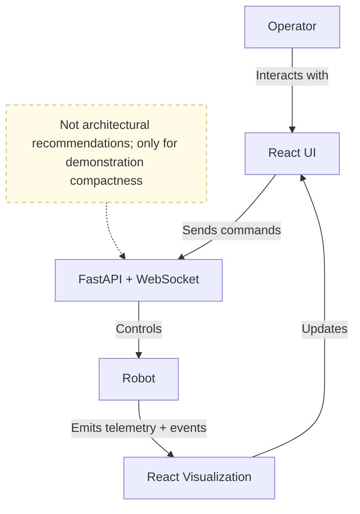

# Robot State and Command Visibility

A minimal React and FastAPI experiment for robot command, telemetry, and failure visibility.

## Why

To separate operator intent, command status, observed state, and stale data.

## How 

Built as a small monorepo with tests prepared on both sides.
