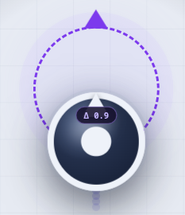
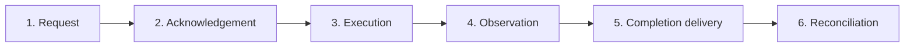
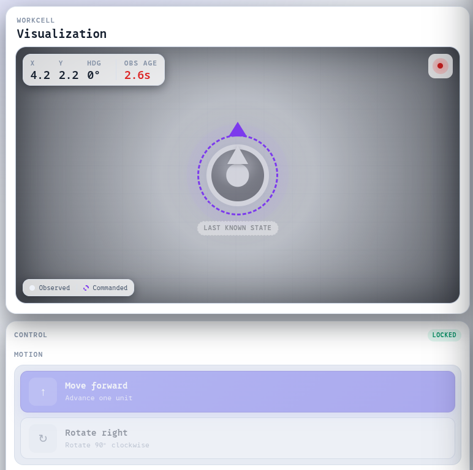
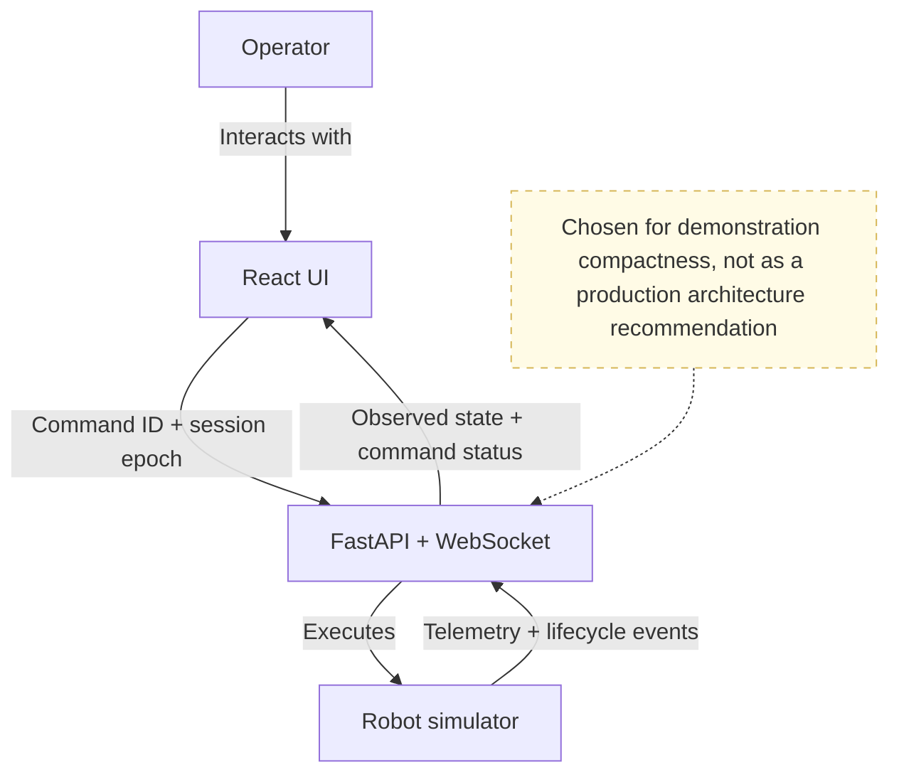

# Robot State and Command Visibility

A React and FastAPI failure-mode study of operator trust: what should a robot interface show when it cannot honestly claim to know the robot's current state?

<p align="center">
  
</p>

<p align="center">
  <em>The commanded pose moves first. The solid robot is the latest observed state.</em>
</p>

## Demo

The most important scenario is not a visible crash. It is a command that may have physically completed while the browser never received the completion event.

<p align="center">
  <a href="res/lost-completion-reconciliation.webm">
    <strong>▶ Watch the lost-completion and reconciliation demo</strong>
  </a>
</p>

The clip shows:

```text
REQUESTED
→ ACKNOWLEDGED
→ EXECUTING
→ robot reaches target
→ connection lost before completion delivery
→ OUTCOME UNKNOWN
→ reconnect and reconcile
→ COMPLETED
```

## Why

A robot dashboard cannot afford to confidently visualize a state that is not true.

Interfaces make that mistake when they collapse several different claims into one apparent "robot state":

- what the operator requested;
- what the command pipeline accepted;
- what execution attempted;
- what the robot was last observed doing;
- how old that observation is;
- whether the command result reached the interface.

This demo keeps those claims separate. When they disagree, the UI reports uncertainty instead of presenting intention, acknowledgement, or stale data as physical truth.

## Stages



| Stage                   | What it establishes                                                                 |
| ----------------------- | ----------------------------------------------------------------------------------- |
| **Request**             | The operator expressed intent. Nothing has been accepted or executed yet.           |
| **Acknowledgement**     | The backend accepted or rejected the command. Acceptance is not completion.         |
| **Execution**           | The command is being attempted and may complete, fail, or be interrupted.           |
| **Observation**         | Telemetry reports what the robot was last observed doing.                           |
| **Completion delivery** | The execution result reaches the operator interface.                                |
| **Reconciliation**      | An uncertain result is resolved against the backend command ledger after reconnect. |

## Failure scenarios

The control panel injects three deterministic failures, each at a different stage.

### 1. Observation failure

Telemetry becomes stale while the WebSocket remains connected.

<p align="center">
  
</p>

The interface preserves the last observed pose, marks it stale, disables ordinary motion controls, and keeps the simulated emergency-stop action available.

> Connection alive does not mean robot state trustworthy.

### 2. Execution failure

A rotation command is acknowledged and begins executing, then fails before the robot heading changes.

```text
REQUESTED → ACKNOWLEDGED → EXECUTING → FAILED
```

The interface does not present command acceptance as physical completion.

### 3. Completion-delivery failure

A movement completes, but the connection drops before the completion event reaches the browser.

The UI marks the command `UNKNOWN`, disables retry, and waits for reconciliation from the in-memory backend command ledger.

<p align="center">
<video controls src="res/lost-completion-reconciliation.webm" title="reconciliation"></video>
</p>
<p align="center">
 <a href="res/lost-completion-reconciliation.webm">
    <strong>or download the reconciliation video</strong>
  </a>
</p>

## Invariants

The scenarios enforce two rules with regression tests:

> A command with an external side effect must not be retried merely because its response was lost.

> A message from an expired session epoch must not mutate the current operator state.

Commands carry client-generated IDs. Reusing an existing ID returns its recorded status instead of executing it again.

Server messages carry a session epoch. The client rejects messages emitted under an older session.

## What the demo covers

- commanded state versus observed state;
- explicit command lifecycle;
- continuously derived telemetry freshness;
- deterministic observation, execution, and completion-delivery failures;
- command identity and idempotent reconciliation;
- session-epoch fencing on the client;
- interruptible simulated emergency stop;
- frontend and backend regression tests.

## Intentionally unresolved

This is a focused work sample, not a production control architecture.

The current implementation deliberately does not provide:

- client-side validation of robot-state sequence numbers;
- command expiry for messages delayed in transit;
- exclusive control ownership across multiple operators or sessions;
- a durable command ledger or server-side audit history;
- persistence across backend restarts;
- a safety-rated emergency-stop path.

These boundaries are documented so the demo does not imply guarantees it does not provide.

## Architecture



The backend simulator owns commanded state, observed state, active execution, and the process-local command ledger.

The frontend owns presentation state, derives telemetry freshness, and rejects messages from expired session epochs.

## Run

```sh
docker compose up --build
```

Open `http://localhost:3000` and choose a failure scenario from the control panel.

For development with hot reload:

```sh
pnpm dev
```

## Verify

```sh
pnpm test
pnpm lint
pnpm build
```

CI runs the same verification commands with Node.js 24 and Python 3.12.

## Documentation

- [Architecture and invariants](docs/ARCHITECTURE.md)
- [Development workflow](CONTRIBUTING.md)

## Demo limitations

Robot state, command history, active faults, queued delayed events, session epochs, and reconciliation state are stored in backend process memory.

Restarting the backend resets the complete simulation. This keeps the experiment deterministic and easy to run; it is not a production durability, control-authority, or safety design.
