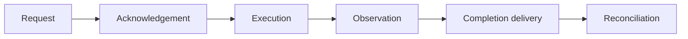

# Architecture

This document explains the design model behind the demo and maps it to the implementation.

The repository is a focused failure-mode experiment. It is not a recommendation for a production robot-control architecture.

---

## 1. Design model

### "Robot state" is several different claims

A dashboard that displays one undifferentiated robot state quietly merges claims with different authorities and truth conditions.

| Claim | Question | Authority |
| --- | --- | --- |
| **Intent** | What did the operator request? | Client |
| **Command status** | What happened to that request? | Backend command pipeline |
| **Observation** | What was the robot last observed doing? | Telemetry source |
| **Freshness** | How reliable is that observation now? | Derived from observation time |
| **Delivery** | Did the execution result reach the interface? | Transport and session state |
| **Reconciliation** | What is the authoritative result after uncertainty? | Backend command ledger within the running process |

When these claims agree, presenting them together is harmless. The design problem appears when they disagree:

- a command is acknowledged but later fails;
- telemetry stops while the socket remains connected;
- physical execution completes but the completion event is lost;
- a delayed message arrives from an expired session.

The core decision is therefore:

> Keep intent, command status, observation, freshness, and delivery state separate in both the protocol and the UI.

Disagreement is rendered as uncertainty, not converted into a confident guess.

### Command and observation stages



1. **Request** records operator intent.
2. **Acknowledgement** confirms acceptance or rejection.
3. **Execution** may complete, fail, or be interrupted.
4. **Observation** reports what telemetry last saw.
5. **Completion delivery** communicates the execution result to the browser.
6. **Reconciliation** resolves an ambiguous result after reconnect.

The three injected faults attack different stages:

| Fault | Failed stage | Result |
| --- | --- | --- |
| `telemetry_delay` | Observation | The socket stays open while telemetry becomes stale. |
| `rotation_failure` | Execution | Rotation is accepted and starts, then fails before heading changes. |
| `lost_completion_after_execution` | Completion delivery | Movement completes, but the result does not reach the browser until reconciliation. |

## 2. Invariants

Two invariants are load-bearing and covered by regression tests.

### Idempotency under retry

> A command with an external side effect must not be retried merely because its response was lost.

A missing response does not prove that execution failed. Reissuing the same physical action could duplicate movement.

### Session-epoch fencing

> A message from an expired session epoch must not mutate the current operator state.

After reconnect, messages from the previous session may still be delayed or queued. The client must reject them before applying any state transition.

A session epoch fences message consumption. It does **not** establish exclusive control ownership; that remains outside the current demo.

## 3. Mechanisms

### Client-generated command IDs and command ledger

The client assigns an ID before sending a command.

The backend stores a `CommandRecord` keyed by that ID. A repeated ID returns the recorded status and does not enter an execution path again.

This makes retry behavior mechanical rather than dependent on caller discipline.

The ledger is authoritative only within the lifetime of the running backend process. It is not durable.

### Session epochs

Each connection receives a monotonically increasing session epoch.

Every server message is stamped with the epoch under which it was emitted. The frontend rejects a message when its epoch is lower than the current session epoch.

The comparison occurs before message-specific state handling.

### Explicit unknown outcome

When the socket closes while a command is acknowledged or executing, the frontend moves that command to `unknown`.

While unknown:

- the UI does not claim success;
- the UI does not claim failure;
- automatic retry is disabled;
- the command waits for a backend reconciliation event.

### Authoritative reconciliation

After reconnect, the backend replays the command ledger's recorded verdict through a `command_reconciliation` message.

The frontend resolves `unknown` only when the command ID matches the reconciliation result.

### Telemetry freshness

Each robot-state message contains `observedAtMs`.

The frontend recomputes age continuously, even when no messages arrive:

```text
live → delayed → stale
```

Staleness changes the operating UI:

- the last observation remains visible;
- the visualization no longer presents it as current;
- ordinary motion controls are disabled;
- the simulated emergency-stop action remains available.

The emergency-stop path in this repository is demonstrative and not safety-rated.

---

## 4. Process topology

```text
┌────────────────────────┐   WebSocket    ┌─────────────────────────────┐
│ Frontend: React + Vite │◄──────────────►│ Backend: FastAPI + uvicorn  │
│ useRobotSocket         │                │ RobotSession per socket     │
│ :5173 or :3000         │                │ RobotSimulator singleton    │
└────────────────────────┘                │ :8000                       │
                                          └─────────────────────────────┘
```

The frontend dev server proxies `/ws` to the backend. In the containerized demo, the UI is published on port `3000`.

The backend exposes:

```text
GET /api/health
WS  /ws
```

There is no database.

## 5. Backend

### Modules

| Module | Responsibility |
| --- | --- |
| [`protocol.py`](../backend/app/protocol.py) | Commands, statuses, faults, message types, and robot modes. |
| [`state.py`](../backend/app/state.py) | Pose and robot state; stamps sequence and observation time. |
| [`simulation.py`](../backend/app/simulation.py) | Stepwise movement and rotation plus timing configuration. |
| [`session.py`](../backend/app/session.py) | WebSocket sessions, command ledger, epochs, faults, telemetry, and reconciliation. |

### Session lifecycle

`RobotSession.run()` accepts the socket and starts a new session through `RobotSimulator`.

Starting a session:

1. increments the session epoch under a lock;
2. installs the new delivery channel;
3. sends `session_started`;
4. sends `connection_status: live`;
5. sends an immediate robot-state snapshot;
6. flushes queued completion and reconciliation messages;
7. starts periodic telemetry.

A newer connection replaces the active delivery channel, but the backend does not yet enforce exclusive command ownership against older open sockets.

### Command handling

For each command:

1. require `commandId`;
2. look up the ID in the ledger;
3. if present, replay the recorded status without execution;
4. otherwise create a `CommandRecord`;
5. validate operating constraints;
6. dispatch execution;
7. record lifecycle changes.

Only one ordinary command executes at a time.

The simulated emergency stop can interrupt the active execution task. Reset restores the simulator to its demonstration baseline.

### Fault injection

#### `telemetry_delay`

The telemetry path delays delivery long enough for `observedAtMs` to cross the frontend freshness thresholds.

The WebSocket remains open. This demonstrates that transport liveness is not observation freshness.

#### `rotation_failure`

The backend acknowledges `rotate_right`, reports execution, and then emits `failed` without changing the actual heading.

This separates acceptance from completion.

#### `lost_completion_after_execution`

The backend:

1. acknowledges and starts `move_forward`;
2. schedules authoritative completion in the simulator and ledger;
3. drops the connection before delivering the completion event;
4. records completion after the client is gone;
5. queues completion and reconciliation messages;
6. flushes them to the next session.

A fault-generation counter prevents delayed telemetry captured under a cleared fault from being emitted later.

## 6. Frontend

### Modules

| File | Responsibility |
| --- | --- |
| [`useRobotSocket.ts`](../frontend/src/useRobotSocket.ts) | Connection, command lifecycle, epochs, reconnect, faults, and reconciliation. |
| [`telemetry.ts`](../frontend/src/telemetry.ts) | Continuously derives telemetry freshness from observation age. |
| [`App.tsx`](../frontend/src/App.tsx) | Composes panels and derives control availability. |
| [`RobotView.tsx`](../frontend/src/RobotView.tsx) | Renders commanded and observed pose separately. |
| [`EventLog.tsx`](../frontend/src/EventLog.tsx) | Presents recent operator-facing events. |
| [`useEventHistory.ts`](../frontend/src/useEventHistory.ts) | Maintains the bounded client-side event history. |

### Epoch fencing

The first relevant check in the WebSocket message handler determines whether a message belongs to an expired session epoch.

Expired messages are ignored before they can update:

- robot state;
- connection state;
- command lifecycle;
- fault state;
- event-derived presentation.

Only `session_started` can advance the current epoch.

### Unknown and reconciliation

If the socket closes while the current command is acknowledged or executing, the frontend sets the command status to `unknown`.

The reconnect delay is intentionally longer while the outcome is unknown so that the ambiguous state remains visible in the demonstration.

A matching `command_reconciliation` replaces `unknown` with the ledger's resolved status.

The client does not infer completion from robot position and does not automatically resend the command.

## 7. Protocol

### Client to server

| Message | Required data |
| --- | --- |
| `command` | `commandId`, `command`, `sessionEpoch` |
| `set_fault` | Fault identifier |
| `clear_fault` | Active fault identifier or clear action |

### Server to client

All server messages carry `sessionEpoch`.

| Message | Meaning |
| --- | --- |
| `session_started` | Announces the newly assigned session epoch. |
| `connection_status` | Reports transport state. |
| `robot_state` | Contains sequence, observation time, mode, commanded pose, and actual pose. |
| `command_status` | Reports acknowledgement, execution, completion, failure, abortion, or rejection. |
| `command_reconciliation` | Resolves an ambiguous command from the ledger. |
| `fault_status` | Confirms fault activation or clearing. |
| `error` | Reports unsupported or invalid input. |

## 8. Lost-completion sequence

```text
operator          frontend                     backend
   │                  │                           │
   │ move forward     │                           │
   │─────────────────►│ command {id, epoch N}     │
   │                  │──────────────────────────►│ ledger[id] = acknowledged
   │                  │◄── acknowledged/executing │ movement starts
   │                  │                           │ completion scheduled
   │                  │◄── connection closes ─────│ result not delivered
   │ sees UNKNOWN     │ status → unknown          │ movement completes
   │ retry disabled   │                           │ ledger[id] = completed
   │                  │ reconnect ───────────────►│ epoch N+1
   │                  │◄── session_started ───────│
   │                  │◄── reconciliation ─────────│ recorded verdict
   │ sees COMPLETED   │ unknown → completed       │
```

## 9. Enforcement and tests

| Property | Enforcement | Regression coverage |
| --- | --- | --- |
| Reusing a command ID does not repeat execution | Ledger lookup before command dispatch | Backend WebSocket tests |
| Lost completion becomes unknown rather than failed | Frontend close handling | Frontend application tests |
| Unknown commands are resolved from the ledger | Reconciliation message matched by command ID | Backend and frontend tests |
| Expired session messages cannot update UI state | Session-epoch guard before message handling | Frontend application tests |
| Stale telemetry disables ordinary controls | Continuous freshness classification | Frontend telemetry and application tests |
| Emergency stop interrupts active simulation | Cancellable backend execution task | Backend WebSocket tests |

## 10. Known limitations

These are deliberate scope boundaries, not implied guarantees:

- robot-state `sequence` is emitted but not checked client-side;
- in-session ordering relies on the WebSocket's TCP ordering;
- commands do not expire in transit;
- the backend does not enforce exclusive control ownership;
- the event log is client-side, bounded, and not an audit trail;
- ledger, epochs, robot state, and faults are process-local;
- backend restart clears all reconciliation history;
- emergency stop is simulated and not safety-rated.

See the README's **Intentionally unresolved** section for the reviewer-facing summary.
